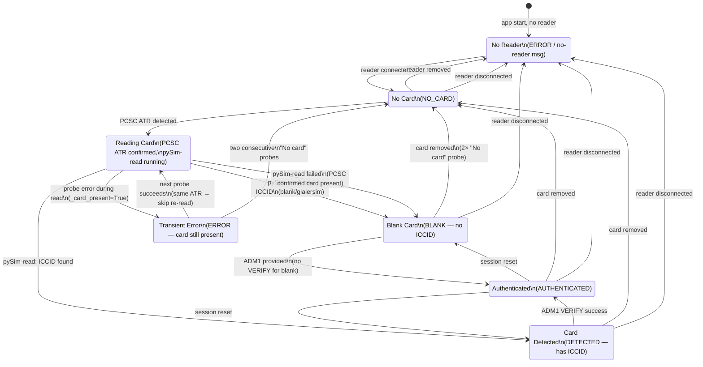

# SimGUI Reader / Card State Machine

This document is the authoritative source of truth for how SimGUI tracks card reader
presence, physical card presence, and card read state. All widgets and managers must
follow these invariants. When in doubt, consult this document.

---

## Principles

1. **StateManager is the single source of truth.** No widget may infer hardware state
   from label text, ICCID presence, IMSI presence, or pySim exit codes.

2. **Reader presence, card presence, and card readability are separate concepts.**
   - The reader can be absent even if a "card info" is still cached in StateManager.
   - A card can be physically inserted even if pySim-read fails or returns no ICCID.
   - "Card content could not be fully read" is not the same as "card not inserted".

3. **Every tab subscribes to `StateManager` signals.** No tab polls, no tab reads
   state from another widget.

4. **Every tab also syncs from current `StateManager` state at construction time**,
   because signals may have fired before the tab existed (e.g., card detected before
   "Program SIM" tab was opened).

5. **`CardState.ERROR` does not mean "no card inserted".** It means "reader or PCSC
   communication error" — which may be transient, may be a no-reader condition, or
   may be a read error while the card is still present. Widgets must not equate ERROR
   with absent card.

6. **Only a confirmed card-removal event (`CardState.NO_CARD`) may demote the UI to
   "Insert a SIM card...".**

---

## State Dimensions

### ReaderState (logical, not yet an explicit enum)

| Value        | Meaning                                    |
|--------------|--------------------------------------------|
| DISCONNECTED | No reader hardware detected                |
| CONNECTED    | Reader hardware present                    |

### CardPresenceState (logical, not yet an explicit enum)

| Value    | Meaning                                               |
|----------|-------------------------------------------------------|
| UNKNOWN  | Reader connected but presence not yet confirmed       |
| ABSENT   | Reader connected, no card ATR detected                |
| INSERTED | PCSC probe returned a valid ATR — card is physically  |
|          | in the reader regardless of whether pySim-read works |

### CardReadState (logical, not yet an explicit enum)

| Value         | Meaning                                               |
|---------------|-------------------------------------------------------|
| NOT_ATTEMPTED | No read attempted yet                                 |
| READABLE      | pySim-read returned ICCID and/or IMSI                 |
| PARTIAL_READ  | pySim-read returned some fields but not ICCID/IMSI    |
|               | (e.g. blank gialersim: may return ACC but no ICCID)  |
| READ_ERROR    | pySim-read failed; card may still be physically present|

### CardType

See `docs/reference/card-types.md` for the full list. The key distinction for state
machine purposes:

| Type       | ICCID present | Uses CHV for auth |
|------------|---------------|-------------------|
| SJA5       | Yes           | 0x0A              |
| GIALERSIM  | No (blank)    | 0x0C (hardcoded)  |
| MAGIC      | Yes           | 0x0A              |
| UNKNOWN    | Unknown       | Unknown           |

---

## Current Implementation Mapping

SimGUI currently uses a single `CardState` enum (in `state_manager.py`) that combines
reader state, card presence, and read state into one dimension. Future work should
split these (see "Desired Future Signals" below), but the current code is documented
here for all maintainers.

```python
class CardState(Enum):
    NO_CARD       # Reader connected, no card inserted (confirmed by PCSC probe)
    DETECTED      # Card inserted, ICCID read successfully, not yet authenticated
    AUTHENTICATED # Card inserted, ADM1 verified
    ERROR         # Reader or PCSC communication error (may be transient)
    BLANK         # Card inserted but no ICCID (factory-blank / gialersim)
```

### Mapping to logical states

| CardState     | ReaderState | CardPresenceState | CardReadState  |
|---------------|-------------|-------------------|----------------|
| NO_CARD       | CONNECTED   | ABSENT            | NOT_ATTEMPTED  |
| DETECTED      | CONNECTED   | INSERTED          | READABLE       |
| AUTHENTICATED | CONNECTED   | INSERTED          | READABLE       |
| BLANK         | CONNECTED   | INSERTED          | PARTIAL_READ   |
| ERROR         | UNKNOWN*    | UNKNOWN*          | READ_ERROR*    |

\* ERROR is ambiguous — it conflates no-reader, reader hardware error, and transient
PCSC failure. Use the error message content to distinguish:
- Message contains `"No smart-card reader"` → reader physically absent
- Other messages → transient PCSC error; card may still be physically present

---

## Invariants

These rules are non-negotiable. Violating them causes incorrect UI behaviour.

### Reader and card presence

- If `CardState in (BLANK, DETECTED, AUTHENTICATED)` → card is physically inserted.
  Do NOT show "Insert a SIM card...".
- If `CardState == NO_CARD` → reader is connected but no card; show "Insert a SIM card...".
- If `CardState == ERROR` → unknown; preserve the last known card-present state if
  any was established in this session.

### ERROR handling

- `ERROR` must not automatically mean "no card inserted".
- A transient PCSC error while the watcher's `_card_present = True` (PCSC confirmed
  ATR before pySim-read finished) must NOT demote the UI to "Insert a SIM card...".
- `ERROR` may be set only if:
  1. The error message contains `"No smart-card reader"` (reader physically absent), OR
  2. No card has ever been physically confirmed present in this session
     (`_card_present == False` AND `card_state not in (BLANK, DETECTED, AUTHENTICATED)`)
- When a widget receives `card_state_changed(ERROR)` and has previously established
  card-present state (`_step >= 1` or equivalent), it must preserve the card-present
  display rather than resetting to "Insert a SIM card...".

### Missing ICCID / IMSI

- Missing ICCID does NOT imply card absent. Blank gialersim cards have no ICCID.
- Missing IMSI does NOT imply card absent. Blank gialersim cards have no IMSI.
- ICCID and IMSI are not required for card-present state.
- `CardState.BLANK` represents card-inserted-but-unreadable-ICCID — it is a
  card-present state, not an absent state.

### Card removal

- Only a confirmed `CardState.NO_CARD` transition (from `on_card_removed()` callback,
  which requires two consecutive "No card in reader" PCSC probes for blank cards)
  may transition the UI to "Insert a SIM card...".
- A read error (`READ_ERROR`) is NOT a card removal.
- A transient PCSC error is NOT a card removal.

### Consistency across tabs

- All tabs subscribe to the same `card_state_changed` signal on the same StateManager.
- A transition to BLANK in one tab is a transition to BLANK in all tabs.
- No tab may locally track "has a card" state that diverges from StateManager.

---

## Signals

### Current signals

| Signal                    | Type        | Meaning                                      |
|---------------------------|-------------|----------------------------------------------|
| `card_state_changed`      | `CardState` | Card reader state changed                    |
| `card_info_changed`       | `CardInfo`  | ICCID, IMSI, card_type, or other info changed|
| `status_changed`          | `str`       | Status bar text update                       |
| `error_occurred`          | `str`       | Non-fatal error for toast/log display        |
| `mode_changed`            | `AppMode`   | Hardware ↔ Simulator toggle                  |
| `share_status_changed`    | `ShareStatus`| Network share mount/unmount                 |

### Desired future signals (not yet implemented)

These would remove the ambiguity in `CardState.ERROR` and allow finer-grained UI
reactions. They should be added in a future refactor — the current fix must not
require them.

| Signal                    | Type                  | Meaning                              |
|---------------------------|-----------------------|--------------------------------------|
| `reader_state_changed`    | `ReaderState`         | Reader connected / disconnected      |
| `card_presence_changed`   | `CardPresenceState`   | Physical card inserted / removed     |
| `card_read_state_changed` | `CardReadState`       | pySim-read result (readable/partial/error)|

Until these signals exist, widgets must apply the invariants documented above when
handling `CardState.ERROR`.

---

## UI Mapping — Program SIM Tab

| Condition                                            | Status message                          | Program Card |
|------------------------------------------------------|-----------------------------------------|--------------|
| No reader connected (`ERROR` from no-reader message) | "No card reader detected"               | Disabled     |
| Reader connected, no card (`NO_CARD`)                | "Insert a SIM card..."                  | Disabled     |
| Card inserted, no form data (`BLANK`/`DETECTED`)     | "Blank/Card detected — select data..."  | Disabled     |
| Card inserted, form data present                     | "Card detected — ready to program"      | **Enabled**  |
| `ERROR` with prior card presence (`_step >= 1`)      | Preserve last card-present message      | Preserved    |

### Program Card enablement rule

Program Card is enabled when ALL of the following are true:
1. `card_state in (BLANK, DETECTED, AUTHENTICATED)` — card is physically inserted, OR
   `_step >= 1` — card presence was established before a transient error
2. At least one form field has data (IMSI, Ki, OPc, ADM1, etc.)

ICCID and IMSI are NOT required. Blank cards have neither.

---

## State Transition Diagram



---

## Implementation Notes

### Why `_card_present` matters in `on_error`

`CardWatcher._card_present` is set to `True` synchronously when the PCSC probe
returns a valid ATR — before `_read_and_notify()` (pySim-read) starts. The StateManager
`card_state` is not updated to `BLANK` or `DETECTED` until pySim-read finishes and
`on_card_unknown()` or `on_card_detected()` fires.

During this window (ATR confirmed, pySim-read running), a concurrent PCSC probe
failure (e.g., from `_startup_detect_card` on the main thread) can fire `on_error`
with `current = NO_CARD`. The guard in `on_error` must check BOTH `card_state` AND
`_card_present` to prevent setting `CardState.ERROR` during this window.

### Why the panel guard matters

Even with the `on_error` guard, a race between the main thread's startup probe and
the background CardWatcher thread can still occasionally set `CardState.ERROR` before
`CardState.BLANK` is established. The panel-level guard (`_step >= 1`) ensures that
even if `ERROR` fires unexpectedly, the panel does not reset to "Insert a SIM card..."
if it has already established card-present state.

### Debounce for blank cards

Blank gialersim cards can cause a transient "No card in reader" PCSC response
immediately after pySim-read releases the reader. `CardWatcher` requires two
consecutive "No card in reader" probes before firing `on_card_removed()`. This
prevents spurious card-removal events for blank cards.
